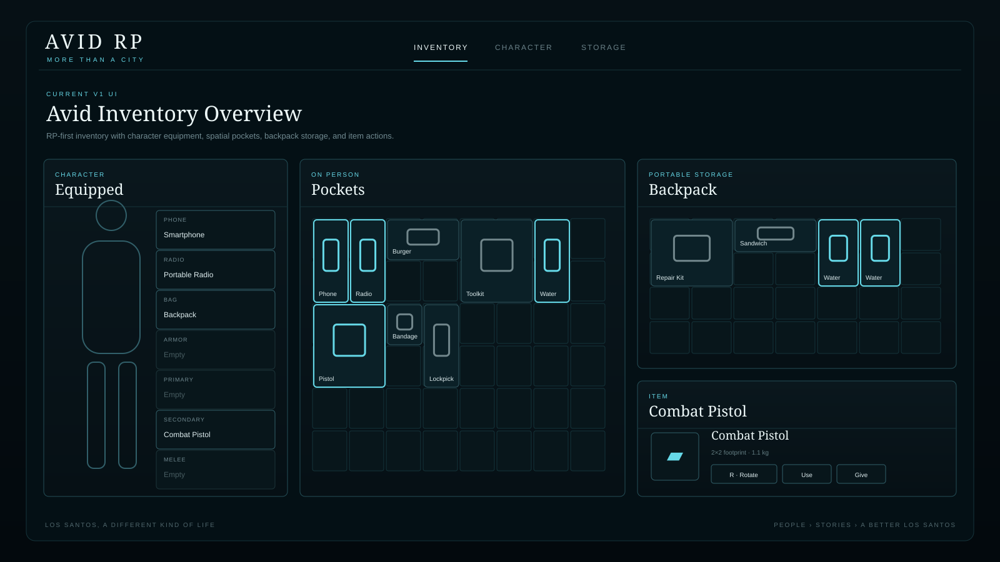
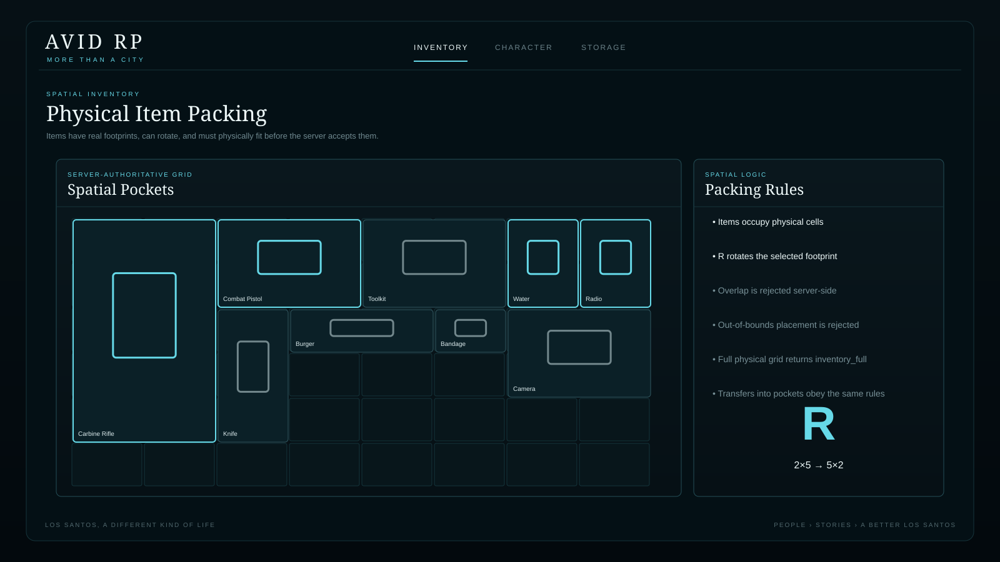
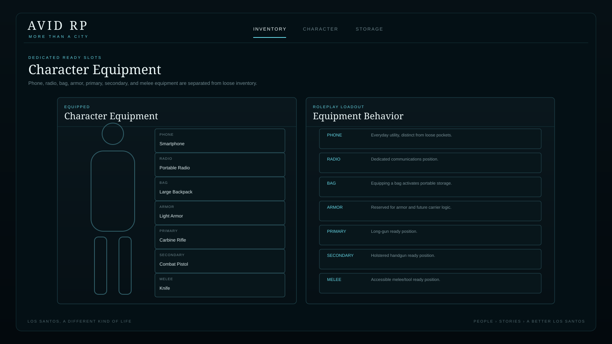
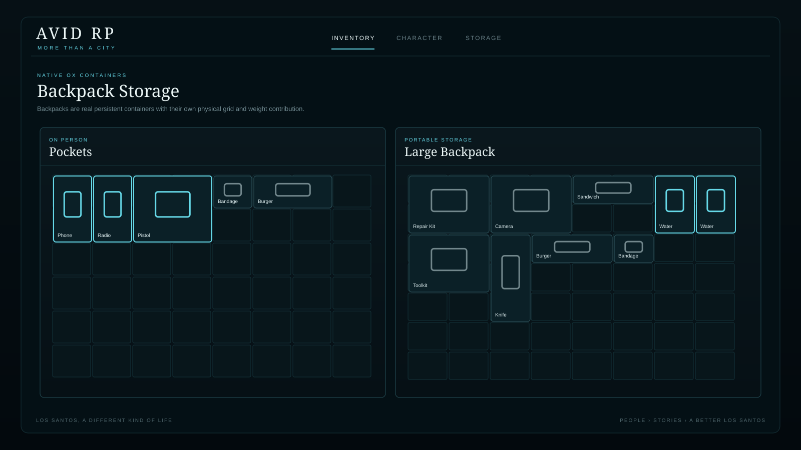
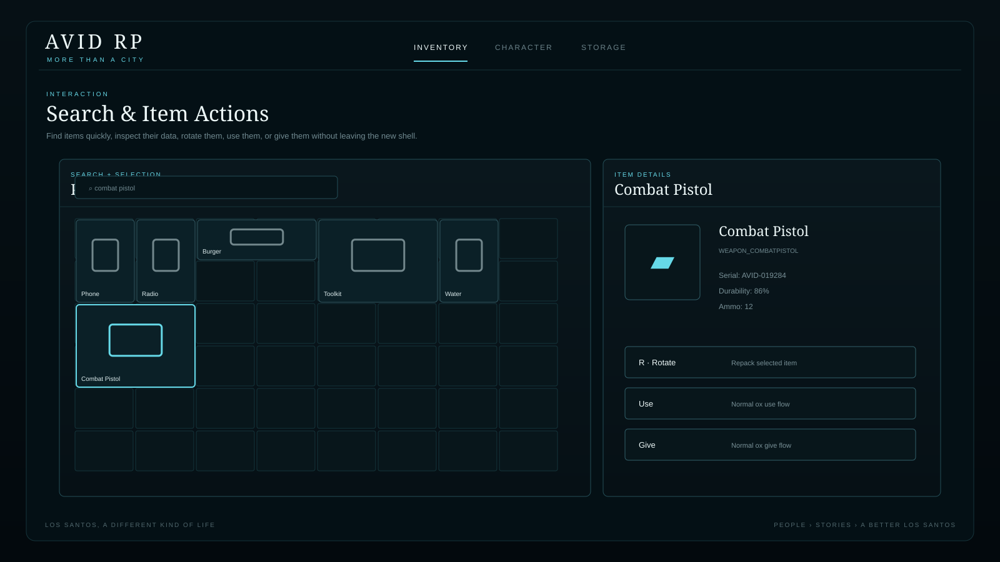
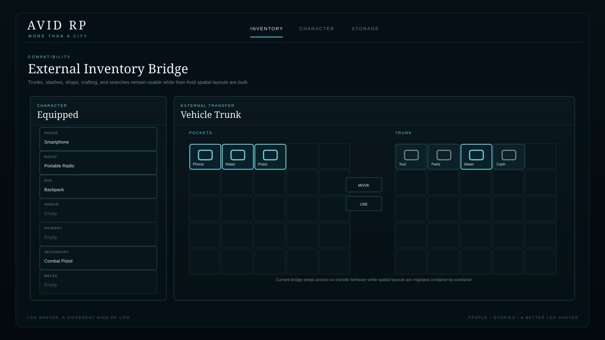

# Avid RP Inventory

<div align="center">

**A spatial, roleplay-first inventory system for FiveM, built on a maintained fork of ox_inventory.**




</div>

---

## What this fork is

This repository is the Avid RP inventory system.

It keeps the proven server-side inventory behavior and ecosystem compatibility of **ox_inventory**, while replacing the classic slot-only experience with a physical, roleplay-oriented carrying system.

The goal is simple:

> What a player can *own*, what they can *carry*, and what they can *actually have equipped* should be three different things.

That means long guns take real space, backpacks create separate storage, phones and radios have dedicated equipment positions, and items can be rotated and repacked instead of existing as identical 1×1 squares.

This fork is currently developed on:

```
feature/avid-inventory-v1
```

The default `main` branch remains the clean upstream baseline while the Avid implementation is validated.

---

# Feature Overview

## Spatial Inventory

Player pockets are no longer treated as a simple list of identical slots.

Items have physical footprints and must fit inside the available grid.



Current behavior includes:

- 8×6 on-person pocket grid
- item-specific width and height
- item rotation
- collision detection
- bounds checking
- server-authoritative placement validation
- physical-capacity checks in `CanCarryItem`
- physical-capacity checks in `AddItem`
- physical-capacity checks during normal ox transfer paths
- persistent item positions
- automatic migration/placement for items without existing spatial data
- overflow detection without deleting player items

Examples:

| Item | Example Footprint |
|---|---:|
| Bandage | 1×1 |
| Phone | 1×2 |
| Water bottle | 1×2 |
| Pistol | 2×2 |
| Repair kit | 2×2 |
| Light armor | 2×3 |
| SMG | 2×4 |
| Rifle | 2×5 |
| Pump shotgun | 2×6 |

Footprints are configurable in:

```
modules/avid/config.lua
```

---

## Dedicated Character Equipment

Items that are merely carried are different from items that are ready to use.



The current equipment layer includes dedicated positions for:

- Phone
- Radio
- Backpack
- Armor
- Primary weapon
- Secondary weapon
- Melee weapon

Equipment state is persistent and validated server-side.

The equipment layer also gives Avid room to expand into holsters, duty belts, plate carriers, slings, clothing storage, and other serious-RP mechanics without bloating the normal pocket grid.

---

## Real Backpack Storage

Backpacks are not fake weight bonuses.

They are native ox_inventory containers with their own persistent contents.



Current backpack tiers:

| Backpack | Slots | Max Weight | Spatial Layout |
|---|---:|---:|---:|
| Small Backpack | 30 | 10 kg | 6×5 |
| Backpack | 42 | 18 kg | 7×6 |
| Large Backpack | 56 | 26 kg | 8×7 |

Current behavior:

- equipping a backpack activates separate portable storage
- backpack contents remain tied to that specific container item
- backpack contents contribute to the player's total carried weight
- players can drag items between pockets and backpack storage
- nested backpacks are blocked
- removing the backpack does not magically dump its contents
- each backpack can retain its own persistent contents through ox container metadata

---

## Search, Item Details, Use, Give, and Rotation

The new interface keeps common ox item interactions while adding spatial controls.



Current interaction behavior:

- Search carried items
- Select items for detailed information
- Press **R** to rotate a selected item
- Double-click an on-person item to use it
- **ALT + click** can use an on-person item
- Use keeps normal ox_inventory item/weapon handling
- Give keeps normal ox_inventory give flow
- Metadata such as serials, durability, ammo, descriptions, and custom labels remains intact

---

## Existing ox_inventory Compatibility

Avid is being built as a fork, not as an incompatible replacement for the entire ox ecosystem.

Normal ox APIs and exports remain available wherever possible.



At the current development stage, these inventory types continue to use the proven ox transfer interface inside the Avid shell:

- Trunks
- Gloveboxes
- Stashes
- Shops
- Crafting
- Player searches
- Evidence inventories
- Drops

Transfers **into spatial player inventories are still validated against available physical room server-side**.

These external inventory types will progressively receive native Avid spatial layouts in later passes.

---

# What Changed From Upstream ox_inventory

The fork currently adds or changes the following areas.

## New Avid modules

```
modules/avid/config.lua
modules/avid/spatial.lua
modules/avid/server.lua
modules/avid/client.lua
```

These handle:

- grid layout configuration
- item footprint definitions
- collision and boundary validation
- automatic placement
- equipment validation
- backpack state
- NUI callbacks
- spatial state serialization

## Inventory server changes

`modules/inventory/server.lua` now understands physical capacity in addition to weight and normal ox slot capacity.

Avid currently integrates spatial behavior into:

- inventory creation
- inventory loading
- inventory saving
- `SetSlot`
- `AddItem`
- `CanCarryItem`
- cross-inventory movement
- cross-inventory swapping

This prevents scripts from bypassing spatial capacity simply because they use a normal ox export or transfer path.

---

# Spatial State Architecture

Avid placement state intentionally does **not** live inside normal ox item metadata.

Instead, it is stored beside the normal slot data:

```lua
slot.avid = {
    version = 1,

    grid = {
        x = 3,
        y = 2,
        rotated = false
    },

    equipped = 'secondary'
}
```

Why?

ox_inventory uses item metadata when determining stack identity.

Putting grid positions inside `metadata` would cause otherwise identical items to stop stacking merely because they occupy different coordinates.

Keeping `slot.avid` separate means existing metadata continues to work normally:

- serial numbers
- durability
- ammo
- weapon components
- custom labels
- container IDs
- phone/SIM data
- item descriptions
- other script metadata

---

# UI Design

The Avid interface is intentionally darker, quieter, and more spatial than stock ox_inventory.

The current visual language uses:

- Avid cyan `#66d9e8`
- thin borders
- dark translucent panels
- Garamond/serif display typography
- modern sans-serif utility text
- minimal tactical styling
- reduced combat emphasis when combat equipment is empty
- separate visual areas for carried, equipped, and stored items

The target is a serious-RP inventory, not a military simulator pasted over Los Santos.

---

# Current Controls

| Input | Action |
|---|---|
| Inventory key | Open inventory |
| Drag | Reposition item |
| Drag between panels | Move between pockets and equipped backpack |
| R | Rotate selected item |
| Double-click | Use on-person item |
| ALT + click | Quick use |
| Existing ox hotbar keys | Existing ox hotbar behavior |

---

# Automatic NUI Builds

You do **not** need to locally compile the React UI to deploy the development branch.

GitHub Actions automatically:

1. installs frontend dependencies
2. runs TypeScript compilation
3. runs the Vite production build
4. commits the generated `web/build` directory back into the branch

Workflow:

```
.github/workflows/avid-inventory-build.yml
```

FiveM continues loading:

```
web/build/index.html
```

The source UI lives under:

```
web/src/components/avid_inventory/
```

---

# Qbox / FiveM Stack

The Avid fork is being developed primarily for:

- qbx_core / Qbox
- ox_inventory
- ox_lib
- oxmysql

Existing ox framework support remains inherited from upstream, but Avid RP development and validation is focused on Qbox first.

---

# Current Development Status

## Implemented

- [x] Avid React inventory shell
- [x] Compiled FiveM NUI
- [x] GitHub automatic UI build pipeline
- [x] Spatial player pockets
- [x] Item footprints
- [x] Rotation
- [x] Collision checks
- [x] Bounds checks
- [x] Spatial persistence
- [x] Server-side spatial capacity checks
- [x] Spatial-aware `AddItem`
- [x] Spatial-aware `CanCarryItem`
- [x] Spatial-aware normal ox transfers
- [x] Character equipment layer
- [x] Phone equipment position
- [x] Radio equipment position
- [x] Backpack equipment position
- [x] Armor equipment position
- [x] Primary weapon equipment position
- [x] Secondary weapon equipment position
- [x] Melee equipment position
- [x] Native ox backpack containers
- [x] Multiple backpack tiers
- [x] Backpack weight synchronization
- [x] Nested backpack protection
- [x] Pocket ↔ backpack movement
- [x] Search
- [x] Item details
- [x] Use
- [x] Give
- [x] Existing ox hotbar compatibility
- [x] Existing external inventory compatibility

## In Progress / Planned

- [ ] Native spatial trunks
- [ ] Native spatial gloveboxes
- [ ] Native spatial stashes
- [ ] Native spatial evidence storage
- [ ] Native spatial player searches
- [ ] Native spatial shops
- [ ] Native spatial crafting
- [ ] Plate carrier / armor plate system
- [ ] Soft armor behavior
- [ ] Duty belts
- [ ] Tool belts
- [ ] Clothing storage
- [ ] Purse / handbag storage
- [ ] Weapon sling / accessibility rules
- [ ] Backpack world/clothing appearance integration
- [ ] Additional item footprint tuning
- [ ] Full live Qbox server validation pass

---

# Installation During Development

Use the Avid development branch:

```bash
git clone --branch feature/avid-inventory-v1 https://github.com/njtank/ox_inventory.git
```

The repository already contains a compiled `web/build`.

Normal ox_inventory dependencies still apply.

Recommended resource order remains:

```cfg
ensure oxmysql
ensure ox_lib
ensure qbx_core
ensure ox_inventory
```

Your server configuration should use the normal ox_inventory Qbox configuration.

For upstream configuration reference, see:

https://overextended.dev/ox_inventory

---

# Important Testing Note

This branch is under active development.

Before replacing a production inventory, validate:

- existing player inventory migration
- AddItem / RemoveItem usage in custom resources
- shops
- crafting
- vehicle storage
- stashes
- weapon use
- item metadata
- container items
- disconnect/reconnect persistence
- server restarts
- player death/confiscation flows

The branch is intentionally kept separate from `main` until live Avid server validation is complete.

---

# Upstream Project

Avid RP Inventory is built from **ox_inventory**.

Upstream repository:

https://github.com/overextended/ox_inventory

Upstream documentation:

https://overextended.dev/ox_inventory

The original ox_inventory project provides the foundation for item handling, metadata, stashes, shops, crafting, framework bridges, weapons, vehicle storage, synchronization, hooks, and the broader ecosystem this fork extends.

Please retain the repository's existing license, notices, and contributor attribution.

---

<div align="center">

### Avid RP

**More than a city.**

Built for character-driven roleplay, physical inventory decisions, and a Los Santos where what you carry actually matters.

</div>
